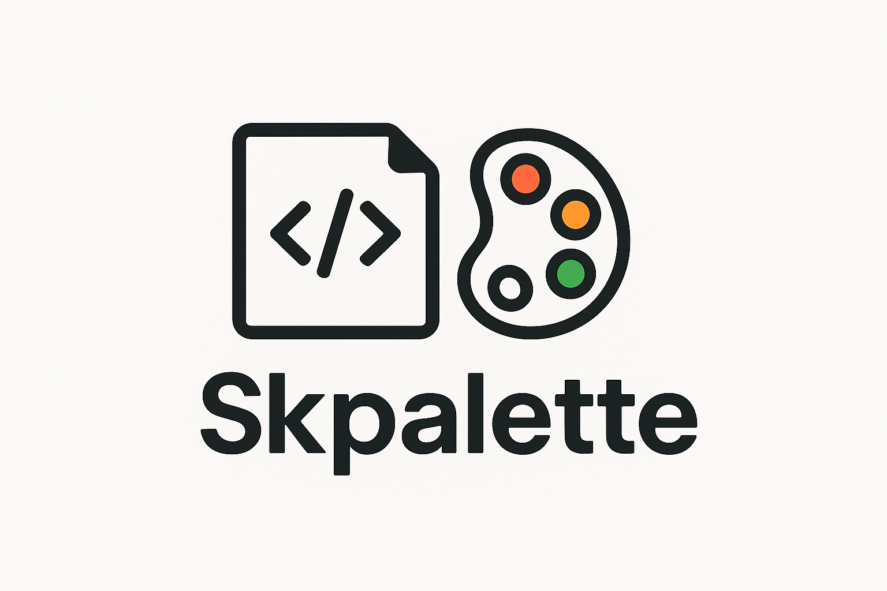

# SkriptPalette

_SkriptPalette_ is a super cool and developer-friendly Skript addon designed to bring **enhanced visual effects** and creative tools to your Minecraft server scripts. Perfect for scripters who want to add a splash of color, particles, and dynamic visuals—without complex coding!

## Features

### 1. Visual Effects
- **Custom Particle Effects:** Easily trigger rainbows, glows, spirals, and themed particle patterns.
- **Gradient Titles & Actionbars:** Send titles, subtitles, and actionbars with animated gradients or color cycling.
- **Rich Chat Formatting:** Add gradients, animated text, and interactive hover/click chat events.
- **Dynamic Bossbars:** Create animated, color-shifting bossbars for events and announcements.
- **Firework Utilities:** Instantly launch fireworks with custom colors and shapes.

## Example Usages

```skript
# Show a rainbow spiral at the player's location
palette show spiral particle rainbow at player for 3 seconds

# Send an animated gradient title to all players
palette send title "<#FF00FF>Welcome <#00FFFF>Back!" to all players with fade in 10, stay 60, fade out 10

# Fancy chat message with hover text
palette send chat "<gradient:#FF0000:#FFFF00>Click Me!</gradient>" to player with hover "This is SkriptPalette in action!"
```

## Installation

1. Place `SkriptPalette.jar` in your `plugins` folder.
2. Ensure [Skript](https://github.com/SkriptLang/Skript) is installed.
3. Restart your server and start adding super cool effects to your scripts!

## Roadmap

- More animated particle shapes
- Customizable color palettes
- Scripting API for addon developers
